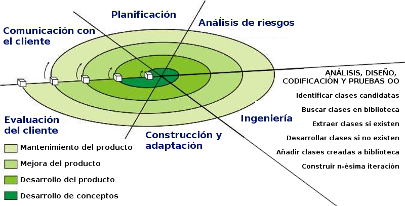
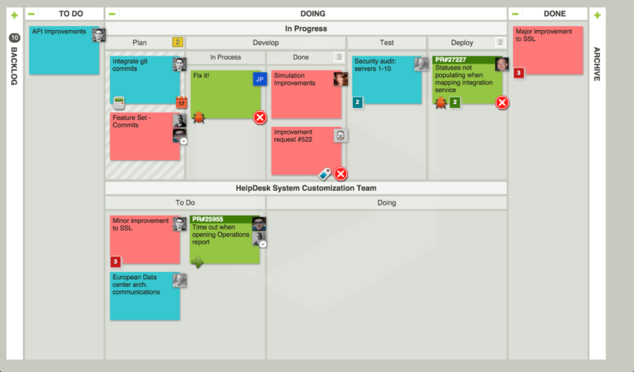
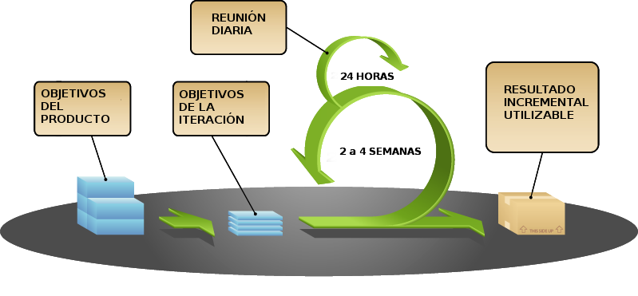

# Unidad 1: Elementos de desarrollo del software

## Introducción

### En esta Unidad aprenderemos a

* Reconocer la relación de los programas con los componentes del sistema informático.
* Diferenciar código fuente, objeto y ejecutable.
* Identificar las fases de desarrollo de una aplicación informática.
* Clasificar los lenguajes de programación.

### Tipos de software

* **De sistema** \(Sistema operativo, drivers\)
* **De aplicación** \(Suite ofimática, Navegador, Edición de imagen, ...\)
* **De desarrollo** \(Editores, compiladores, interpretes, ...\)

### Relación Hardware-Software

* **Disco duro** : almacena de forma permanente los archivos ejecutables y los archivos de datos.
* **Memoria RAM** : almacena de forma temporal el código binario de los archivos ejecutables y los archivos de datos necesarios.
* **CPU** : lee y ejecuta instrucciones almacenadas en memoria RAM, así como los datos necesarios.

La CPU no puede leer en el disco, solo a traves de la memoria RAM y las intrucciones esta en código binario.

* **E/S** :

  recoge nuevos datos desde la entrada, se muestran los resultados, se leen/guardan a disco, ...

### Códigos fuente, objeto y ejecutable

* **Código fuente**: archivo de texto legible escrito en un lenguaje de programación.
* **Código objeto** \(intermedio\): archivo binario no ejecutable.
* **Código ejecutable**: archivo binario ejecutable. 

Código objeto está destinado al procesador nativo, execpto el bytecode de java que está destinada la Máquina Virtual Java \(MVJ\).

## Ciclo de vida del software

### Ingeniería de software

> Disciplina que estudia los principios y metodologías para el desarrollo y mantenimiento de sistemas software.

* Algunos autores consideran que "_**desarrollo de software**_" es un término más apropiado que "_**ingeniería de software**_" puesto que este último implica niveles de rigor y prueba de procesos que no son apropiados para todo tipo de desarrollo de software.
* [Ingeniería del software](https://es.wikipedia.org/wiki/Ingeniería_de_software)

### Desarrollo de software

#### _**Fases principales**_

* **ANÁLISIS**  
* **DISEÑO**
* **CODIFICACIÓN**
* **PRUEBAS**
* **MANTENIMIENTO**  

#### **ANÁLISIS**

* Se determina y define claramente las necesidades del cliente y se especifica los requisitos que debe cumplir el software a desarrollar. 
* La especificación de requisitos debe:
  * Ser completa y sin omisiones
  * Ser concisa y sin trivialidades
  * Evitar ambigüedades
  * Evitar detalles de diseño o implementación
  * Ser entendible por el cliente
  * Separar requisitos funcionales y no funcionales
  * Dividir y jerarquizar el modelo
  * Fijar criterios de validación

#### **DISEÑO**

* Se descompone y organiza el sistema en elementos componentes que pueden ser desarrollados por separado.
* Se especifica la interrelación y funcionalidad de los elementos componentes.
* Las actividades habituales son las siguientes:
  * Diseño arquitectónico
  * Diseño detallado
  * Diseño de datos
  * Diseño de interfaz

#### **CODIFICACIÓN**

* Se escribe el código fuente de cada componente.
* Pueden utilizarse distintos lenguajes informáticos:
  * **Lenguajes de programación**: C, C++, Java, Javascript, ...
  * **Lenguajes de otro tipo**: HTML, XML, JSON, ...

#### **PRUEBAS**

* El principal objetivo de las pruebas debe ser conseguir que el programa funcione incorrectamente y que se descubran defectos.
* Deberemos someter al programa al máximo número de situaciones diferentes.

#### **MANTENIMIENTO**

* Durante la explotación del sistema software es necesario realizar cambios ocasionales.
* Para ello hay que rehacer parte del trabajo realizado en las fases previas.
* Tipos de mantenimiento:
  * **Correctivo**: se corrigen defectos.
  * **Perfectivo**: se mejora la funcionalidad.
  * **Evolutivo**: se añade funcionalidades nuevas.
  * **Adaptativo**: se adapta a nuevos entornos.

### Resultado tras cada fase \(I\)

* Ingeniería de sistemas: **Especificación del sistema**
* ANÁLISIS: **Especificación de requisitos del software**
* DISENO arquitectónico: **Documento de arquitectura del software**
* DISENO detallado: **Especificación de módulos y funciones**
* CODIFICACIÓN: **Código fuente**

### Resultado tras cada fase \(II\)

\( _Continuación_ \)

* PRUEBAS de unidades: **Módulos utilizables**
* PRUEBAS de integración: **Sistema utilizable**
* PRUEBAS del sistema: **Sistema aceptado**
* Documentación: **Documentación técnica y de usuario** 
* MANTENIMIENTO: **Informes de errores y control de cambios**

### Modelos de desarrollo de software

* Modelos clásicos \(predictivos\)
  * Modelo en cascada
  * Modelo en V
* Modelo de construcción de prototipos
* Modelos evolutivos o incrementales
  * Modelo en espiral \(iterativos\)
  * Metodologías ágiles \(adaptativos\)

### Modelo en cascada \(I\)

### Modelo en cascada \(II\)

* Modelo de mayor antigüedad.
* Identifica las fases principales del desarrollo software.
* Las fases han de realizarse en el orden indicado.
* El resultado de una fase es la entrada de la siguiente fase.
* Es un modelo bastante rígido que se adapta mal al cambio continuo de especificaciones.
* Existen diferentes variantes con mayor o menor cantidad de actividades.

### Modelo en V \(I\)

### Modelo en V \(II\)

* Modelo muy parecido al modelo en cascada.
* Visión jerarquizada con distintos niveles.
* Los niveles superiores indican mayor abstracción.
* Los niveles inferiores indican mayor nivel de detalle.
* El resultado de una fase es la entrada de la siguiente fase.
* Existen diferentes variantes con mayor o menor cantidad de actividades.

### Prototipos \(I\)

* A menudo los requisitos no están especificados claramente:
  * por no existir experiencia previa.
  * por omisión o falta de concreción del usuario/cliente.

### Prototipos \(II\)

* Proceso:
  * Se crea un prototipo durante la **fase de análisis** y es probado por el usuario/cliente para refinar los requisitos del software a desarrollar.
  * Se repite el paso anterior las veces necesarias.

### Prototipos \(III\)

* Tipos de prototipos:
  * **Prototipos rápidos** 
    * El prototipo puede estar desarrollado usando otro lenguaje y/o herramientas.
    * Finalmente el prototipo se desecha.
  * **Prototipos evolutivos** 
    * El prototipo está diseñado en el mismo lenguaje y herramientas del proyecto.
    * El prototipo se usa como base para desarrollar el proyecto.

### Modelo en espiral \(I\)

* Desarrollado por Boehm en 1988.
* La actividad de _**ingeniería**_ corresponde a las fases de los modelos clásicos: análisis, diseño, codificación, ...

### Modelo en espiral \(II\)

#### _**Aplicado a la programación orientada a objetos**_

* En la actividad de _**ingeniería**_ se da gran importancia a la reutilización de código.

### Metodologías ágiles \(I\)

* Son métodos de ingeniería del software basados en el desarrollo iterativo e incremental.
* Los requisitos y soluciones evolucionan con el tiempo según la necesidad del proyecto.
* El trabajo es realizado mediante la colaboración de equipos auto-organizados y multidisciplinarios, inmersos en un proceso compartido de toma de decisiones a corto plazo.
* Las metodologías más conocidas son:
  * Kanban
  * Scrum
  * XP \(eXtreme Programming\)

### Metodologías ágiles \(II\)

[Manifiesto por el Desarrollo Ágil](https://es.wikipedia.org/wiki/Manifiesto_ágil)

* **Individuos e interacciones** sobre procesos y herramientas
* **Software funcionando** sobre documentación extensiva
* **Colaboración con el cliente** sobre negociación contractual
* **Respuesta ante el cambio** sobre seguir un plan

#### **Kanban \(I\)**

* También se denomina "sistema de tarjetas".
* **Desarrollado inicialmente por Toyota para la industria de fabricación de productos**.
* **Controla por demanda** la fabricación de los productos necesarios en la cantidad y tiempo necesarios.
* Enfocado a entregar el máximo valor para los clientes, utilizando los recursos justos.
* [Lean manufacturing](https://es.wikipedia.org/wiki/Lean_manufacturing)
* [Kanban en desarrollo software](https://dosideas.com/noticias/metodologias/184-como-usar-kanban-en-el-desarrollo-de-software)

  El flujo de producción se basa en tarjetas, un ejemplo es de pizarra Kanban

#### **Kanban \(II\)**

Pizarra kanban

#### **Scrum \(I\)**

* Modelo de desarrollo incremental.
* Interaciones \(**sprint**\) regulares cada 2 a 4 semanas.
* Al principio de cada iteración se establecen sus **objetivos priorizados** \(**sprint backlog**\).
* Al finalizar cada iteración se obtiene una **entrega parcial utilizable por el cliente**.
* Existen reuniones diarias para tratar la marcha del _sprint_.

  Apuntes mio: Se hace una reunión al principio que dura unas 2 horas, Las interaciones se llaman sprint. El backlog es los requisitos que tenemos Despues tiene una entrega final, que se le muestra al cliente y lo comprueba. Despues hay dos reuniones, una de presentación de producto y otra de revision inal.

#### **Scrum \(II\)**

#### **XP \(Programación extrema\) \(I\)**

**Valores**

* Simplicidad \(menos errores\)
* Comunicación \(entre los programadores y con los clientes\)
* Retroalimentación \(ver como funciona, y esta relacionado con la comunicación\)
* Valentía o coraje \(El programador tiene que estar dispuesto a renunciar cosas, para que salga adelante el proyecto\)
* Respeto o humildad \(Esa misma persona a la valorar el trabajo de otros lo tiene que hacer por igual, se debe a las personas que tiene el ego muy alto y puede afectar a la relación entre programadores\)

#### **XP \(Programación extrema\) \(II\)**

**Características**

* Diseño  sencillo 
* Pequeñas mejoras continuas
* Pruebas y refactorización
* Integración continua
* **Programación por parejas**
* **El cliente se integra en el equipo de desarrollo** 
* Propiedad del código compartida
* Estándares de codificación
* 40 horas semanales

## Lenguajes de programación

### Obtención de código ejecutable

* Para obtener código binario ejecutable tenemos 2 opciones:
  * **Compilar**
  * **Interpretar**

### Proceso de compilación/interpretación

* La compilación/interpretación del código fuente se lleva a cabo en dos fases: 1. **Análisis léxico** "ortografía" 2. **Análisis sintáctico** "gramática"
* Si no existen errores, se genera el código objeto correspondiente.
* Un código fuente correctamente escrito no significa que funcione según lo deseado.
* No se realiza un análisis semántico.

### Lenguajes compilados

* Ejemplos: Lo más conocidos son: C, C++
* Principal ventaja: Ejecución muy eficiente.
* Principal desventaja: Es necesario compilar cada vez que el código fuente es modificado.

### Lenguajes interpretados

* Ejemplos: PHP, Javascript
* Principal ventaja: El código fuente se interpreta directamente. "Se interpreta y se ejecuta"
* Principal desventaja: Ejecución menos eficiente. "Es menos rápida"

### JAVA \(I\)

* Lenguajes compilado e interpretado.
* El código fuente Java **se compila** y se obtiene un código binario intermedio denominado **bytecode**. 
* Puede considerarse código objeto pero destinado a la máquina virtual de Java en lugar de código objeto nativo. 
* Después este **bytecode** **se interpreta** para ejecutarlo.

  No es un "código objeto" en sí. Ejecutamos el .class

### JAVA \(II\)

* Ventajas:
  * Estructurado y Orientado a Objetos. "Al igual que C++"
  * Relativamente fácil de aprender.
  * Buena documentación y base de usuarios. "hay muchos materiales en internet"
* Desventajas:
  * Menos eficiente que los lenguajes compilados. "La ejecución es un poco más lenta, y no aprovecha al máximo el ordenador"

### Tipos \(I\)

* Según la forma en la que operan:
  * **Declarativos**: indicamos el resultado a obtener sin especificar los pasos. "Lenguaje SQL"
  * **Imperativos**: indicamos los pasos a seguir para obtener un resultado. 

### Tipos \(II\)

* Tipos de **lenguajes declarativos**:
  * Lógicos: Utilizan reglas. Ej: Prolog
  * Funcionales: Utilizan funciones. Ej: Lisp, Haskell
  * Algebraicos: Utilizan sentencias. Ej: SQL
* Normalmente son lenguajes interpretados.

  "Estos lenguajes se usan muy poco salvo el SQL."

### Tipos \(III\)

* Tipos de **lenguajes imperativos**:
  * Estructurados: Por ejemplo C
  * Orientados a objetos: Java
  * Multiparadigma: C++, Javascript \(programación funcional\)
* Los lenguajes orientados a objetos son también lenguajes estructurados. 
* Muchos de estos lenguajes son compilados. Por ejemplo C,C++ ,java es medio compilado.

### Tipos \(IV\)

* Tipos de lenguajes según nivel de abstracción: 
  * Bajo nivel: ensamblador "son programas extensos"
  * Medio nivel: C
  * Alto nivel: C++, Java \(Con una sola abstracción se ejecuta muchos códigos, esto hace que tengamos que escribir menos\)

### Evolución

* Código binario 
* Ensamblador  "mejora de código binario"
* Lenguajes estructurados  "Organizan el código con estructuras"
* Lenguajes orientados a objetos  "Mejora a los lenguajes estructurados, organizas los códigos en clases y después se sacan los objetos"

### Historia simplificada

[Historia simplificada](http://rigaux.org/language-study/diagram-light.png)

### Historia detallada

[Historia detallada](http://rigaux.org/language-study/diagram.png)

### Criterios para la selección de un lenguaje

* Campo de aplicación   "El tipo de aplicación o programa que vamos a desarrollar"
* Experiencia previa     "Tanto la persona como la empresa"      
* Herramientas de desarrollo  "Si hay buenos compiladores o programadores"
* Documentación disponible  "Se busca un lenguaje que tenga documentación"
* Base de usuarios   "Emte más base mejor ya que tiene mas ayuda por internet"
* Reusabilidad   "Las clsaes se puede reutilizar"
* Transportabilidad  "Que se pueda utilizar en muchos sistemos operativos"
* Imposición del cliente  "No hay si se desarrolla una aplicación desde cero"

